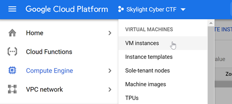
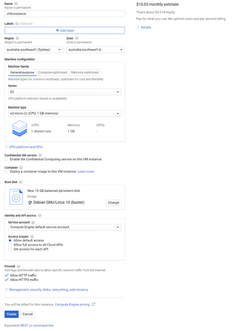
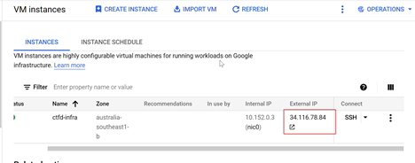
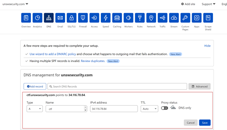
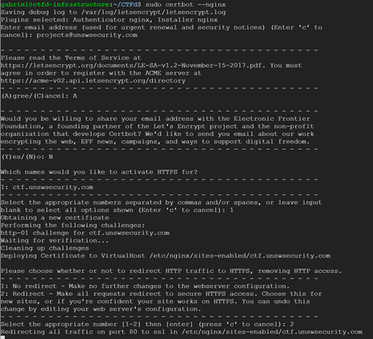

# CTFd Infrastructure Setup

Have you ever wondered how would one set up the infrastructure necessary for a CTF? Back in 2021, I had the opportunity to become the Projects Director at UNSW Security Society (SecSoc) and as such, one of the responsibilities alongside the role was to set up the infrastructure needed to run the society's various CTF competitions. In this post, I'll explain how you would be able to set up a framework to host CTF challenges using CTFd. This walkthrough will be mainly about setting up CTFd using Docker containers on the Google Cloud Platform.

## What is a CTF?

CTFs or better known as capture the flag competitions is a competition to collect the most "flags". These flags can be hidden in different activities, vulnerable programs or websites. To host a capture the flag competition, one would need an online platform where users can submit their "flags" they found and a way keep track of their scores. That's where CTFd comes in.

According to their website, *CTFd is a Capture The Flag (CTF) framework designed for ease of use for both administrators and users*. It can be thought of as a framework where managing CTF competitions becomes ease.

## Why use CTFd?

During my time as Projects Director, we use CTFd as the platform of our hosted capture the flag competitions due to its simple nature to setup. It all comes down to running the CTFd docker container that it comes already and hosting it via the cloud (with the added network features included such as ensuring it to be HTTPs encrypted). Some features of note is the ability to control everything on the platform, whether it is setting to be a team/individual CTF to the different themes you can opt to. You can read more of the features that CTFd has to offer right [here](https://ctfd.io/features/).

## My CTF Beginnings

When being given the task of setting up the infrastructure for SecSoc's CTF, the first thing I did was to understand what a CTF was. One of my main reasons to joining SecSoc was to learn more about cyber security and develop my interest into the field. No doubt that this was perfect to do so. I have often heard the term 'Capture the Flag' before in my first year but I never understood what it means. So the first thing I did was to understand what a CTF was and to get a good practice on how it works. Luckily, as I was part of the SecSoc, there was some awesome people showing me how a CTF works!

My first experience deploying my very own CTF infrastructure was during the 2021 O-Week CTF Competition that SecSoc hosted during February in 2021. I remember that I was given about 3 weeks to deploy the infrastructure. My first week was spent in understanding what a CTF was and seeing how it was hosted. My second week was spent in understanding the platforms that was used previously within SecSoc when hosting such CTF infrastructure. My third week was spent in deploying the infrastructure itself and making sure it was ready. Looking back, the third week was the most intense but it was the most rewarding when I finally finished it, as I had to ensure that everything was up and running.

## Deploying the CTF infrastructure

### Prior Knowledge

When setting up a CTF infrastructure, it's really handy to have a good understanding of the technologies. This can range from how to use Docker/docker-compose, SSL certificates (HTTPS encryption), domains and setting up DNS records. Obviously there is more that you should know before setting up a CTF infrastructure but these are the main things.

### Deployment

Now comes the exciting bit to setup CTFd so that we have a platform to serve CTF challenges. As described on their website, *CTFd is a Capture The Flag (CTF) framework designed for ease of use for both administrators and users*. It all comes down to deploying the docker container that CTFd comes in and hosting it on the cloud. I would like to make a huge mention to [csictf](https://medium.com/csictf) and their article titled ["Self-hosting a CTF Platform"](https://medium.com/csictf/self-hosting-a-ctf-platform-ctfd-90f3f1611587) as it helped me in setting up my own infrastructure and forms the basis of this guide. So at anypoint if I'm not clear on, it might be useful to refer back to their article for further guidance. This guide is tailored to deploying it to the Google Cloud Platform.

### Things to Remember!

Before delving into setting up your very own CTF infrastructure, keep these in mind. Be cautious on how much money a VM instance (or any other GCP service) is using. Since we are using the cloud to host the platform, it costs money! Don't forget to take down the infrastructure you're finish with using the CTFd platform, so that you won't incur additional costs. Lastly, always remember to scale the platform according to the needs of the CTF competition.


### Deploying the CTFd infrastructure

### Creating a VM instance

1. Create a VM instance using GCP Compute Engine and pick a region to host your CTFd infrastructure (up to you, the default region, which is Iowa seems to be the cheapest. However, I recommend picking **australia-southeast-1b** for the actual CTFs to reduce any latency). 



2. Choose the CPU settings when creating a VM instance. Recommened starting with the **e2-micro** CPU at the beginning as this is good when you want to test the infrastructure with a small number of users. Then you can scale the CPU to use the **e2-medium** CPU during the actual CTF.

   **EDIT: You can set the CPU instace to e2-small if you need more horsepower to install packages quickly. Would just recommended setting it to e2-small now and upscale it during the actual CTF event to e2-medium or e2-large.**

3. Select the default boot disk (debian) rather than using the Container Optimised OS as this allows to use any extra command line arguments (i.e. touch) and package managers (i.e. apt) if needed. More info on what the downsides of using Container Optimised OS can be found here: https://cloud.google.com/container-optimized-os/docs/concepts/features-and-benefits

4. Enable http and https traffic in the firewall settings.

5. Click "Create". You can now ssh into the VM instance!



### Setting up CTFd

6. Once you ssh into the VM, install docker with the following commands (execute these commands line by line):

   ```
   sudo apt update
   sudo apt install --yes apt-transport-https ca-certificates curl gnupg2 software-properties-common
   curl -fsSL https://download.docker.com/linux/debian/gpg | sudo apt-key add -
   sudo add-apt-repository "deb [arch=amd64] https://download.docker.com/linux/debian $(lsb_release -cs) stable"
   sudo apt update
   sudo apt install --yes docker-ce
   sudo usermod -aG docker $USER
   logout
   ```

   and ssh your way back in after **logout**. Now install docker-compose using these commands:

   ```
   sudo curl -L "https://github.com/docker/compose/releases/download/1.28.2/docker-compose-$(uname -s)-$(uname -m)" -o /usr/local/bin/docker-compose
   sudo chmod +x /usr/local/bin/docker-compose
   ```

7. In the home directory, git clone the CTFd repo

   ```
   git clone https://github.com/CTFd/CTFd.git
   cd CTFd
   ```

8. (Optional) Additionally, you can use themes alongside CTFd. Simply put your themes in `./themes` folder.

9. In the CTFd repo, change the root `docker-compose.yml` file to remove the default `nginx` docker service. The `docker-compose.yml` file now should look something like this:

   ```
   version: '2'
   services:
     ctfd:
       build: .
       user: root
       restart: always
       ports:
         - "8000:8000"
       environment:
         - UPLOAD_FOLDER=/var/uploads
         - DATABASE_URL=mysql+pymysql://ctfd:ctfd@db/ctfd
         - REDIS_URL=redis://cache:6379
         - WORKERS=1
         - LOG_FOLDER=/var/log/CTFd
         - ACCESS_LOG=-
         - ERROR_LOG=-
         - REVERSE_PROXY=true
       volumes:
         - .data/CTFd/logs:/var/log/CTFd
         - .data/CTFd/uploads:/var/uploads
         - .:/opt/CTFd:ro
       depends_on:
         - db
       networks:
           default:
           internal:
     db:
       image: mariadb:10.4.12
       restart: always
       environment:
         - MYSQL_ROOT_PASSWORD=ctfd
         - MYSQL_USER=ctfd
         - MYSQL_PASSWORD=ctfd
         - MYSQL_DATABASE=ctfd
       volumes:
         - .data/mysql:/var/lib/mysql
       networks:
           internal:
       # This command is required to set important mariadb defaults
       command: [mysqld, --character-set-server=utf8mb4, --collation-server=utf8mb4_unicode_ci, --wait_timeout=28800, --log-warnings=0]
     cache:
       image: redis:4
       restart: always
       volumes:
       - .data/redis:/data
       networks:
           internal:
   networks:
       default:
       internal:
           internal: true
   ```

### Linking a domain name

Once we have setup the docker environment and configuration for the CTFd infra, it’s time to link a domain name with our associated VM instance (so that users can access the hosted server with a domain). We are using Cloudflare to link our domain to the CTFd external IP.

11. Visit https://www.cloudflare.com/ and login using the SecSoc account. The Projects director/ other directors/ execs should have access to the login credentials.
12. In GCP, find the external address that is associated with VM and copy it.



13. In the Cloudflare menu, add a new DNS A record that links to the external IP address and make sure that the DNS proxy status is **DNS only**. If 'proxied' is selected, all trafic will directly go to cloudflare first then be redirected to the server on the VM instance. Issues with this is that the ctfd server will be rate limiting based on IP address and the Cloudflare proxy causes issues with this.

    We usually link `ctf.unswsecurity.com` to the VM instance.



**NOTE: You may need to create a new A record each time the VM instance gets restarted because the external ip address for GCP is ephemeral, meaning it does not persist each restart (since the VM could get associated with a new IP address).**

### Using a Proxy and firewall

\1.   Now back to the VM instance, set up a firewall and rate limiting using the commands below.

```
2.  sudo apt update
3.  sudo apt install nginx ufw
4.  sudo ufw allow 'Nginx Full'
5.  sudo ufw allow 'OpenSSH'
sudo ufw enable
```

\6.   Create a file at `/etc/nginx/sites-available/mydomain.com` (replace http://mydomain.com with your domain) with the following contents. In this case, since we are using the domain `ctf.unswsecurity.com`, create the file `/etc/nginx/sites-available/ctf.unswsecurity.com`.

```
sudo touch /etc/nginx/sites-available/ctf.unswsecurity.com
```


 Add the following contents to the file (replace `mydomain.com` on line 4 with `ctf.unswsecurity.com`):

```
limit_req_zone  $binary_remote_addr zone=mylimit:10m rate=10r/s;
limit_conn_zone $binary_remote_addr zone=addr:10m;
server {
  server_name mydomain.com;
  limit_req zone=mylimit burst=15;
  limit_conn addr 10;
  limit_req_status 429;
  client_max_body_size 8M;
  location / {
           proxy_pass http://localhost:8000;
        proxy_http_version 1.1;
        proxy_set_header Upgrade $http_upgrade;
        proxy_set_header Connection 'upgrade';
        proxy_set_header Host $host;
        proxy_cache_bypass $http_upgrade;
  }
}
```

This configuration basically sets up a rate-limiting at 10 requests per second, and a max of 10 simultaneous connections per IP address at a time. Also, it tells Nginx to route requests to the specified `server_name` at port 8000.

\7.   Now, we need to create a symbolic link with these commands to enable the configuration file. Replace `mydomain.com` with `ctf.unswsecurity.com` in this case.

```
8.  sudo ln -s /etc/nginx/sites-available/mydomain.com /etc/nginx/sites-enabled/mydomain.com
9.  sudo nginx -s reload
10. 
11.// with ctf.unswsecurity.com instead
12.sudo ln -s /etc/nginx/sites-available/ctf.unswsecurity.com /etc/nginx/sites-enabled/ctf.unswsecurity.com
sudo nginx -s reload
```


 **NOTE that we are creating a symbolic link from** `nginx/sites-available` **to** `nginx/sites-enabled`.

\13. In the root directory of the ctfd file, run `docker-compose up -d` to start up the docker container instance. Now when visiting the domain (i.e. `ctf.unswsecurity.com`), you should see CTFd running on a http connection (since we enabled http/https trafic in the firewall settings earlier,).

### SSLing It Up!

Notice, that the traffic protocol is HTTP, not HTTPS. We need to set up a SSL certificate using Certbot and LetsEncrypt,

\1.   To allow our domain to have HTTPS encryption, we must create an SSL certificate. Luckily, we can use Certbot and LetsEncrypt for this! Follow these commands:

```
sudo apt install certbot
sudo certbot --nginx
 
# If certbot does not work, check if your installing the correct version.
# Alternatives could include installing this instead.
sudo apt-get install python3-certbot-nginx # for ubuntu 20+
```

From [csictf](https://medium.com/csictf/self-hosting-a-ctf-platform-ctfd-90f3f1611587), ***this should prompt you to pick which domains you want to setup nginx for. Select the domain we setup with nginx before for CTFd, and follow the series of questions\*** `certbot` asks. Make sure you ask Certbot to always **Redirect to HTTPS**, we don’t want anyone accessing the website over HTTP!




 If certbot asks for an email to use, you can use the Project’s director `@unswsecurity.com` email. Just use an email that you don’t mind being spammed, as once the certificate expires, it will send notifications to that email. You can also use `projects@unswsecurity.com` as well. 

Now you should see that your CTFd website is fully HTTPs encrypted! You can simply hand over the setup of the ctfd infra now to the CTF team.

