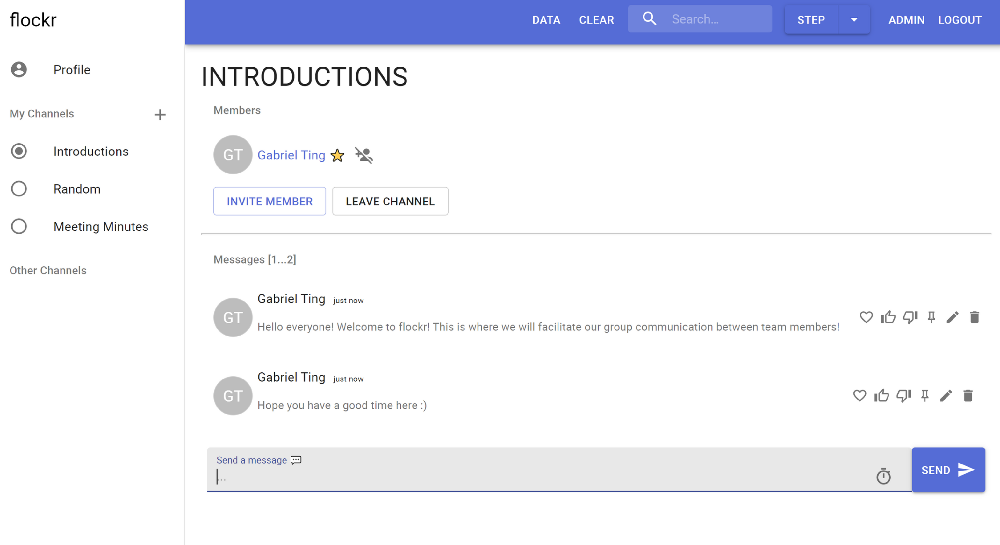

Developed a **backend RESTFUL API** for a messaging and collaboration application, named Flockr, that is similar to existing platforms such as Slack or Flock. This project was developed using Python programming language and uses a Flask server to handle API request for the frontend of the application. 

The frontend of the project was provided as part of a software engineering fundamentals course. To ensure consistency between the backend and frontend, a common interface specification was developed which enables my team to develop and test under the assumption of the common interface. Created an exhaustive test suite to ensure that the implementation of the backend RESTFUL API fully met the specification.

This project was developed with a **team of five**, including myself, where I lead as a team leader and operated with my team members in an **agile approach** such as using task boards, standups and sprints as well as maintained a codebase in a **CI/CD environment**.

## Tech Stack
- Python and Pytest
- Heroku for deployment